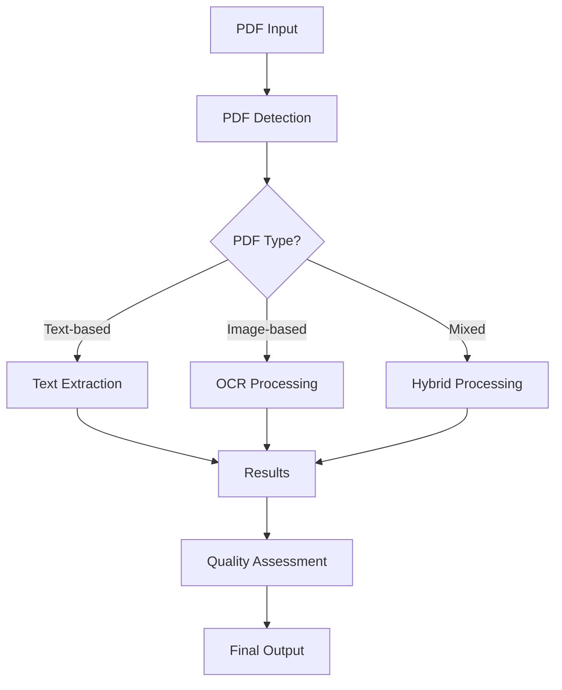

# Unified PDF Processing System

This document describes the new unified PDF processing system that intelligently handles both text-based and image-based PDFs using advanced detection logic and OCR capabilities.

## 🏗️ System Architecture

The system is organized into the following components:

```
backend/
├── utils/
│   ├── pdf_detector.py          # PDF type detection logic
│   ├── pdf_processor.py         # Unified PDF processor
│   └── __init__.py
├── langgraph/
│   ├── ocr_agent.py            # LangGraph OCR agent
│   ├── __init__.py
│   └── graph.py
└── common/
    └── logging.py

test_unified_pdf_system.py       # Comprehensive test script
```

## 🔍 PDF Detection System

### PDFDetector Class

Located in `backend/utils/pdf_detector.py`, this class provides sophisticated PDF analysis:

#### Key Features:
- **Multi-library support**: Uses PyMuPDF, pdfplumber, and PyPDF2 as fallbacks
- **Comprehensive analysis**: Analyzes text density, image presence, page formats
- **Confidence scoring**: Provides confidence levels for detection results
- **Processing recommendations**: Suggests optimal processing methods

#### Detection Criteria:

| PDF Type | Criteria |
|----------|----------|
| **Text-based** | High text density (>500 chars/page), low image coverage (<30%) |
| **Image-based** | Low text density (<200 chars/page), significant images present |
| **Mixed** | Medium text density + moderate image presence |

#### Usage:

```python
from backend.utils import PDFDetector

detector = PDFDetector()

# Full detection with detailed analysis
result = await detector.detect_pdf_type("document.pdf")
print(f"PDF Type: {result['pdf_type']}")
print(f"Confidence: {result['confidence']}")

# Quick check for rapid assessment
quick_result = await detector.quick_check("document.pdf")
print(f"Has images: {quick_result['has_images']}")
```

## 🤖 LangGraph OCR Agent

### LangGraphOCRAgent Class

Located in `backend/langgraph/ocr_agent.py`, this agent provides advanced OCR using OpenAI Vision API:

#### Key Features:
- **LangGraph workflow**: Multi-step processing with error handling and retry logic
- **Medical document focus**: Specialized prompts for assessment documents
- **Quality validation**: Automatic validation and enhancement of extracted text
- **Comprehensive metadata**: Detailed processing information and confidence scores

#### Workflow Steps:
1. **Input Validation**: Validates image format and size
2. **Image Preprocessing**: Optimizes images for OCR (resize, format conversion)
3. **Text Extraction**: Uses OpenAI Vision API with specialized prompts
4. **Response Processing**: Parses and structures the extracted text
5. **Quality Validation**: Validates extraction quality and completeness
6. **Text Enhancement**: Applies corrections and formatting improvements
7. **Result Finalization**: Packages results with metadata

#### Usage:

```python
from backend.langgraph import LangGraphOCRAgent

ocr_agent = LangGraphOCRAgent()

# Process image bytes
result = await ocr_agent.process_image(
    image_data=image_bytes,
    document_type="medical_assessment",
    page_number=1
)

print(f"Extracted text: {result['extracted_text']}")
print(f"Quality score: {result['quality_score']}")
```

## 🔄 Unified PDF Processor

### UnifiedPDFProcessor Class

Located in `backend/utils/pdf_processor.py`, this is the main orchestrator:

#### Key Features:
- **Intelligent routing**: Automatically chooses the best processing method
- **Multi-method processing**: Supports text extraction, OCR, and hybrid approaches
- **Batch processing**: Can process multiple PDFs efficiently
- **Statistics tracking**: Monitors processing performance and success rates
- **Force OCR option**: Can force OCR processing even for text-based PDFs

#### Processing Flow:



#### Usage:

```python
from backend.utils import UnifiedPDFProcessor

processor = UnifiedPDFProcessor()

# Process single PDF
result = await processor.process_pdf(
    "document.pdf",
    document_type="medical_assessment"
)

# Force OCR processing
ocr_result = await processor.process_pdf(
    "document.pdf",
    force_ocr=True
)

# Batch processing
results = await processor.batch_process_pdfs([
    "doc1.pdf", "doc2.pdf", "doc3.pdf"
])

# Get processing statistics
stats = processor.get_processing_stats()
print(f"Success rate: {stats['success_rate']}%")
```

## 📊 Processing Methods

### 1. Text Extraction (for text-based PDFs)
- **Libraries**: pdfplumber → PyPDF2 → PyMuPDF (fallback chain)
- **Speed**: Fast (seconds)
- **Quality**: High for native text PDFs
- **Use case**: Standard document processing

### 2. OCR Vision (for image-based PDFs)
- **Technology**: OpenAI Vision API via LangGraph
- **Speed**: Slower (10-30 seconds depending on image count)
- **Quality**: High for scanned documents and images
- **Use case**: Scanned documents, image-heavy PDFs

### 3. Hybrid Processing (for mixed PDFs)
- **Approach**: Combines text extraction + OCR
- **Speed**: Medium
- **Quality**: Comprehensive extraction
- **Use case**: PDFs with both text and significant images

## 🧪 Testing and Usage

### Running Tests

Use the provided test script to verify functionality:

```bash
python test_unified_pdf_system.py
```

The test script will:
1. Detect available PDF files
2. Test PDF type detection
3. Test processing with different methods
4. Display comprehensive results

### Example Output

```
🔍 TESTING PDF DETECTION

============================================================
PDF DETECTION RESULTS
============================================================
📄 File: assessment_report.pdf
🔍 PDF Type: image_based
📊 Confidence: 0.85
📝 Text Analysis:
   - Total characters: 145
   - Avg chars per page: 48
   - Pages with text: 1
🖼️ Image Analysis:
   - Total images: 3
   - Significant images: 3
   - Large images: 2
💡 Recommendation:
   - Primary method: ocr_vision
   - Expected quality: medium_to_high
   - Processing time: slow
```

## ⚙️ Configuration

### Environment Variables

```bash
# Required for OCR functionality
OPENAI_API_KEY=your_openai_api_key_here
```

### Dependencies

The system requires these packages:
- `PyMuPDF` (fitz) - PDF processing and image extraction
- `pdfplumber` - Text extraction
- `PyPDF2` - Fallback text extraction
- `Pillow` - Image processing
- `openai` - OpenAI API client
- `langchain` - LLM integration
- `langgraph` - Workflow management

## 🔧 Integration with Existing System

### Updating Existing Code

Replace existing PDF processing calls:

```python
# Old approach
text = extract_text_from_pdf(file_path)

# New unified approach
from backend.utils import UnifiedPDFProcessor

processor = UnifiedPDFProcessor()
result = await processor.process_pdf(file_path)
text = result['extracted_text']
processing_method = result['processing_method']
quality_score = result['quality_score']
```

### Error Handling

The system provides comprehensive error handling:

```python
result = await processor.process_pdf(file_path)

if result['processing_complete']:
    text = result['extracted_text']
    print(f"Successfully extracted {len(text)} characters")
else:
    errors = result['processing_errors']
    print(f"Processing failed: {errors}")
```

## 📈 Performance Considerations

### Processing Speed Expectations:

| PDF Type | Method | Typical Time | Quality |
|----------|--------|--------------|---------|
| Text-based | Text extraction | 1-5 seconds | High |
| Image-based | OCR Vision | 10-60 seconds | Medium-High |
| Mixed | Hybrid | 5-30 seconds | High |

### Optimization Tips:

1. **Use quick_check()** for rapid PDF type assessment
2. **Batch processing** for multiple files
3. **Monitor statistics** to track performance
4. **Cache results** for repeated processing

## 🔒 Security and Privacy

- PDF processing is done locally (except OCR which uses OpenAI API)
- No PDF content is permanently stored by the system
- OCR requests to OpenAI follow their data usage policies
- Ensure proper API key management

## 🐛 Troubleshooting

### Common Issues:

1. **No PDF libraries available**
   - Install: `pip install PyMuPDF pdfplumber PyPDF2`

2. **OpenAI API errors**
   - Check API key configuration
   - Verify API quota and billing

3. **Memory issues with large PDFs**
   - The system automatically resizes images for OCR
   - Consider batch processing for multiple large files

4. **Poor OCR quality**
   - Check image quality in the PDF
   - Use force_ocr=False for text-based documents
   - Review the confidence scores in results

### Debug Logging

Enable detailed logging:

```python
import logging
logging.basicConfig(level=logging.DEBUG)
```

## 🚀 Future Enhancements

- Support for additional OCR engines (Tesseract, Azure Cognitive Services)
- Multi-language OCR support
- PDF structure analysis (tables, forms)
- Caching layer for processed results
- Progress tracking for batch operations

## 📞 Support

For issues or questions about the PDF processing system:
1. Check the test script output for diagnostic information
2. Review the logs for detailed error messages
3. Verify all dependencies are properly installed
4. Ensure OpenAI API key is configured correctly 